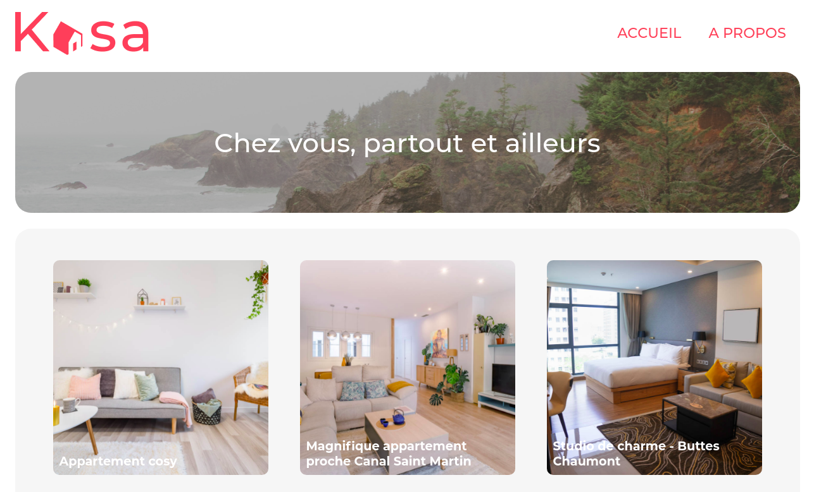

# KASA

## Présentation du contexte
Kasa est une société de location d'appartements entre particuliers en France.

## Ce que ce projet m'a permis de pratiquer

### Compétences

- découper et intégrer une maquette,
- structurer une page web en composants React,
- mettre en forme une page web avec HTLM et CSS3,
- générer du contenu dynamiquement depuis un fichier JSON,

### Technologies / méthodes

- HTML5 / CSS3,
-  Sass,
- React, React DOM, React Router

## Ressources à ma disposition

* maquettes desktop et mobile,
* fichier de données Json.

## Consignes

- les paramètres des routes sont gérés par React Router dans l'URL,
  pour récupérer les informations de chaque logement,
- il existe une page par route,
- la page 404 est renvoyée pour chaque route inexistante, ou si une
  valeur présente dans l’URL ne fait pas partie des données
  renseignées,
- la logique du routeur est réunie dans un seul fichier.

## Livrables attendus

- découpage en composants modulaires et réutilisables,
- un composant par fichier,
- structure logique des différents fichiers,
- utilisation des props entre les composants,
- utilisation du state dans les composants quand c'est nécessaire,
- gestion des événements,
- composants à base de classe, aucun composant fonction,
- le code ne devait pas produire d'erreur ou de warning dans la console.

